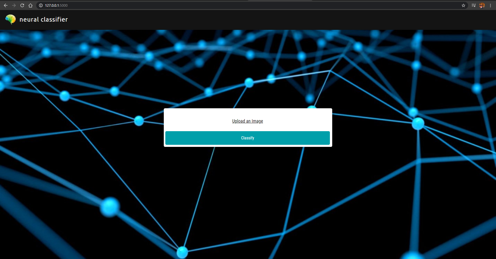
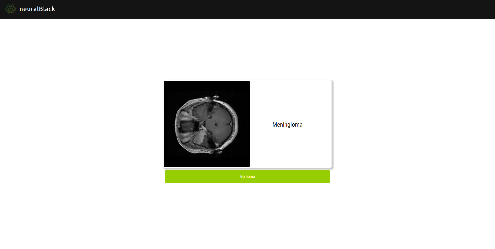
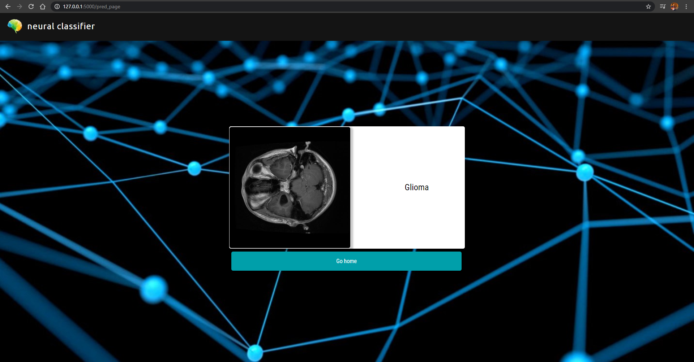
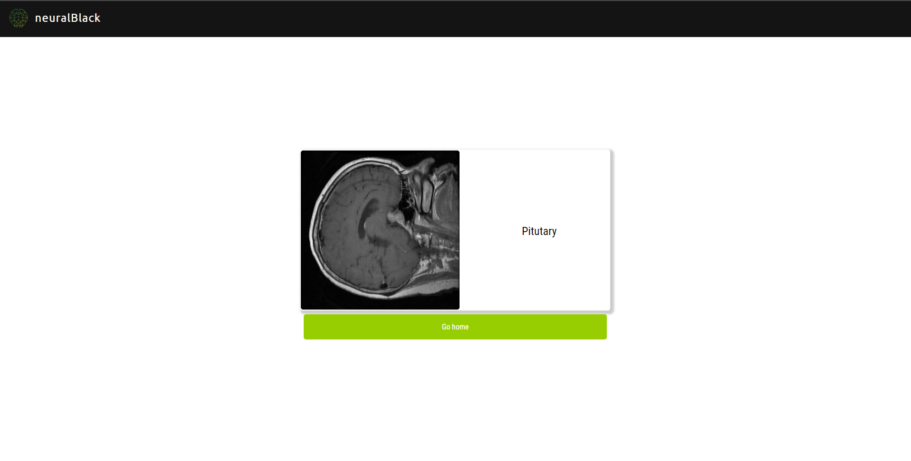
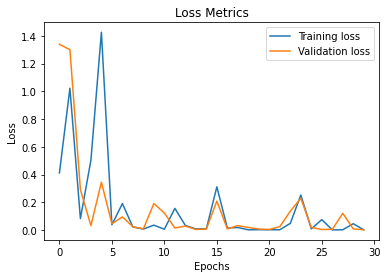
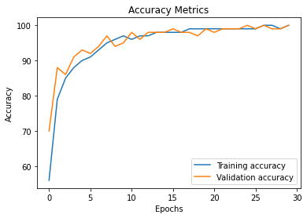
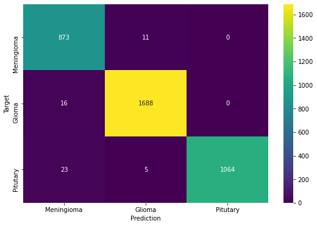

# Brain Tumor Classification

A Brain Tumor Classifier that can classify tumor into 3 classes: **Meningioma, Glioma, and Pitutary**, if present when given an MRI image of brain.

We have used fine-tuned ResNet50 Neural Network architecture with almost **99 % Accuracy** achieved by applying the method of Transfer Learning.

## Dataset

We have used [brain tumor dataset](https://figshare.com/articles/brain_tumor_dataset/1512427) posted by **Jun Cheng**.

This brain tumor dataset containing 3064 T1-weighted contrast-inhanced images from 233 patients with three kinds of brain tumor: meningioma (708 slices), glioma (1426 slices), and pituitary tumor (930 slices). 

## Modules

* [brain_tumor_dataset_preparation.ipynb](brain_tumor_dataset_preparation.ipynb) - An IPython notebook that contains preparation and preprocessing of dataset for training, validation and testing.

* [torch_brain_tumor_classifier.ipynb](torch_brain_tumor_classifier.ipynb) - An IPython notebook that contains all the steps, processes and results of training, validating and testing our brain tumor classifier.

* [test.py](test.py) - A python script which accepts path to an image as input, which then classifies the image into one of the three classes.

* [deploy.py](deploy.py) - A python script integrated with Flask server, that starts the Web Interface on local server where user can upload MRI image of brain and get classification results.

**Note:** We have included few images for testing under [test_images](test_images) directory.

## Running the classifier

Download the classifier model '.pt' file from this [drive link](https://drive.google.com/open?id=1-TOWpgVBayVS-rIrf3Z9R1dV5678zQeL)

Before running the programs, kindly install the requirements as given in Requirements section of this README.

* Use the [test.py](test.py) script for running the script in Terminal, Powershell or Command Prompt.
    * `python test.py`

* Use [deploy.py](deploy.py) script to access the classifier as an interactive web interface.
    * `python deploy.py`

## Screenshots (Results & Web Interface)

### Web Interface

#### Home Page

* 

#### Classification Results via Web Interface

* 

* 

* 

### Classifier Evaluation

#### Loss Graph

* 

#### Accuracy Graph

* 

#### Confusion Matrix

* 

## Requirements

Python 3 is required.

### Computational Specifications

Project done using Google Colab with follwing specifications:

* Ubuntu 18.04 64-bit OS
* 12 GB DDR4 RAM
* 8 GB NVidia Tesla K40 GPU
* 40 GB of Non-Persistent Storage

### Library Requirements

We'll be using the following libraries to complete our classification problem:

* **Numpy** - For linear algebra operations 
* **Torch** - Pytorch Deep Learning Framework
* **OS** - To use Operating System methods
* **Random** - To set random seed at specific places where random operations take place just so it happens the same way everytime it is executed
* **Pandas** - To create DataFrame, CSV files, etc
* **Time** - To perform date time operations
* **Seaborn** - For sophisticated visualization
* **Pickle** - To save and load binary files of our training data
* **Scikit-Learn** - Machien learning framework. We ahve used this for evaluating our Classifier and for cross-validation split
* **Matplotlib** - To visualize images, losses and accuracy
* **Google Colab Drive** - To mount Google Drive so we can perform storage and loading operations using it

Also the above mentioned libraries comes pre-installed and pre-configured with Google Colab.

#### Pytorch

Follow the steps for installation given in the official website of [Pytorch](https://pytorch.org).

#### Other Libraries

Install the required libraries using the pip package manager and requirements.txt file.

Install the required libraries using the [pip](https://pip.pypa.io/en/stable/) package manager.

For pip version 19.1 or above:

~~~bash
pip install -r requirements.txt --user
~~~

or

~~~bash
pip3 install -r requirements.txt --user
~~~

## About

This project was done by Akshay Kumaar M. Research Paper is in progress.

## References

### Research Papers

* [Multi-grade brain tumor classification using deep CNN with extensive data augmentation](https://www.sciencedirect.com/science/article/abs/pii/S1877750318307385)

* [A Deep Learning-Based Framework for Automatic Brain Tumors Classification Using Transfer Learning](https://link.springer.com/article/10.1007/s00034-019-01246-3)

### Documentations

* [Pytorch](https://pytorch.org/docs/stable/index.html)